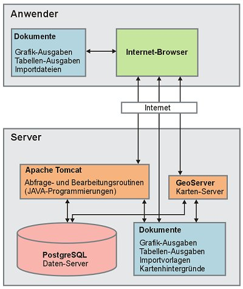

## Inhalt

- [1 Komponenten](#1-Komponenten)
- [2 Hardware](#2-Hardware)
    - [2.1 Server](#2-1-Server)
    - [2.2 Client](#2-2-Client)
- [3 Software](#3-Software)
  - [3.1 Server](#3-1-Server)
    - [3.1.1 Betriebssystem](#3-1-1-Betriebssystem)
    - [3.1.2 Webserver](#3-1-2-Webserver)
      - [3.1.2.1 Struts Framework](#3-1-2-1-Struts-Framework)
      - [3.1.2.2 OpenLayers Framework](#3-1-2-2-OpenLayers-Framework)
    - [3.1.3 Datenbank-Server](#3-1-3-Datenbank-Server)
    - [3.1.4 Datenbank-Administration](#3-1-4-Datenbank-Administration)
    - [3.1.5 Map-Server](#3-1-5-Map-Server)
  - [3.2 Client](#3-2-Client)
- [4 Datensicherung](#4-Datensicherung)
  - [4.1 Vollständige Sicherung der Datenbank](#4-1-Vollstaendige-Sicherung-der-Datenbank)
  - [4.2 Fortschreitende Sicherung der Messdaten](#4-2-Fortschreitende-Sicherung-der-Messdaten)
- [5 Dokumentation](#5-Dokumentation)
  - [5.1 Softwarekomponenten](#5-1-Softwarekomponenten)
  - [5.2 Pflege des Inhalts](#5-2-Pflege-des-Inhalts)
  - [5.3 Erzeugung der HTML-Dokumentation](#5-3-Erzeugung-der-HTML-Dokumentation)

## 1 Komponenten

Den Kern des Fachinformationssystems der FGG Elbe bildet der zentrale Server. Dieser beinhaltet einen Datenbank-Server, in der alle durch die FGG verwalteten Daten abgelegt sind und verwaltet werden können. Die Ausführung von Auswertungs- und Aufbereitungsfunktionen erfolgt, vor einer Übertragung der Ergebnisse an den Anwender, durch Programmmodule auf dem Server.

Struktur des Datenportals der FGG Elbe

Die Steuerung der Programmfunktionen erfolgt durch die Anwender dezentral, von beliebigen Standorten aus, über das Internet. Als Steuerungsoberfläche dienen den Anwendern die durch den zentralen Servers übertragenen Web-Seiten. Auch die Ergebnisse (Grafiken und Tabellen) der Anfragen überträgt der Server über das Internet zum PC des Anwenders.

## 2 Hardware

### 2.1 Server

Die im Informationssystem serverseitig eingesetzen Softwarekomponeten stellen als Mindestanforderung an die Server-Hardware einen Pentium-Prozessor sowie 32 MB Arbeitsspeicher. Um einen performanten Betrieb des FIS zu gewährleisten, sollten mit dem Server 2 x 1,5 GHz garantierte Rechenleistung und 4 GB RAM zur Verfügung gestellt werden. Für die Installation der Software-Komponenten des FIS sowie den Betrieb (Archivierung von Importdateien, Sicherungständen etc.) sollte auf dem Server ein Speicherplatz von mindestens 200 GB zur Verfügung stehen.

### 2.2 Client

Auf der Client-Seite erfolgt der Zugriff auf das Informationssystems über einen PC. Dieser muss für die Kommunikation mit dem Server über eine entsprechende Hardwarekomponente an das Internet angeschlossen sein. Darüber hinaus muss die Hardware für die Ausführung eines Betriebssystems geeignet sein, über das eine Browsersoftware betrieben werden kann.

## 3 Software

### 3.1 Server

#### 3.1.1 Betriebssystem

Auf dem Produktiv-Server ist Windows Server 2008 (64bit) als Betriebssystem installiert.

#### 3.1.2 Webserver

Als Webserver wird die Software Apache Tomcat in der Version 7.0.27 (64bit) eingesetzt. Diese erfordert diese erfordert die Installation der Java-Umgebung Java SE 6 JRE.

##### 3.1.2.1 Struts Framework

Bei der Entwicklung des Webprojektes wurde auf dem Framework Struts 2 aufgesetzt. Die genutzten Softwarekomponenten des Frameworks sind in das Projektverzeichnis des Informationssystems integriert und müssen somit nicht gesondert installerit werden.

##### 3.1.2.2 OpenLayers Framework

Das Webprojekt bindet für das Web-Mapping Funktionalitäten des Frameworks Openlayers (Vers. 2.10) ein. Die genutzten Softwarekomponenten des Frameworks sind in das Projektverzeichnis des Informationssystems integriert und müssen somit nicht gesondert installiert werden.

#### 3.1.3 Datenbank-Server

Die Datenhaltung erfolgt über den Datenbank-Server PostgreSQL in der Version 8.3.14 (32bit). Die Kommunikation erfolgt über den Port 5432. Zur Verwaltung der Geo-Daten ist die erforderliche Erweiterung PostGIS in die Installation integriert. Zur Erstellung der Vollbackups wird die Komponente pg_dump.exe des Softwarepakets genutzt.

#### 3.1.4 Datenbank-Administration

Zur Administration des Datenbankservers ist auf dem System die Software pgAdmin (Version 1.8.4) installiert. Grundsätzlich ist der Zugriff auf die Datenbank auch mit einer entfernt installierten Administrationssoftware ohne funktionelle Einschränkungen möglich. Bei transferintensiven Zugriffen kann die Nutzung der Server-Installation aber Vorteile bei der Ausführungsgeschwindigkeit haben.

#### 3.1.5 Map-Server

Die Bereitstellung von Geodaten für die Web-Mapping-Komponente des Informationssystems erfolgt durch die Software GeoServer in der Version 2.1.3 (32Bit). Die Kommunikation erfolgt über den Port 8085. Die Software basiert auf Java-Code und erfordert (wie auch die Server-Software Apache Tomcat) die Installation einer Java-Laufzeitumgebung.

### 3.2 Client

Der Zugriff auf das Informationssystem durch den Client erfolgt durch einen Webbrowser (z.B. Internet Explorer, Firefox, Google Chrome). Da die Funktionen des Informationssystems nicht auf betriebssystem- oder browserspezifischen Funktionen zugreifen, kann hinsichtlich der Software eine beliebige lauffähige Kombination aus Betriebssystem und einem aktuellen Webbrowser genutzt werden. Für die Anwendung des Informationssystems sind Cookies und JavaScript zu aktivieren.

## 4 Datensicherung

(Update erforderlich)
Die Sicherung des Datenbestands des FIS der FGG Elbe erfolgt auf zwei Wegen. Zum Einen erfolgt in festen Intervallen ein vollständiges Backup der Datenbank. Diese Backups eignen sich insbesondere zur Wiederherstellung des Gesamtzustands der Datenbank bei einem Datenbankausfall durch einen Soft- oder Hardwarefehler. Darüber hinaus erfolgt eine ständige Aufzeichnung von Änderungen im Messdatenbestand. Diese Sicherung dient in erster Linie der Rekonstruktion und Prüfung einzelner Messdatenreihen bzw. deren Bearbeitung.

### 4.1 Vollständige Sicherung der Datenbank

Das Betriebssystem startet regelmäßig einen Sicherungsprozess. Dieser Vorgang kann unter Start>Verwaltung>Sever-Manager unter dem Punkt Aufgabenplanung angepasst werden. Initial ist eine tägliche Sicherung eingestellt. Das Backup sollte zu einem zugriffarmen Zeitpunkt (z.B. in der Nacht) erfolgen, um die Leistung des Systems nicht unnötig einzuschränken.

Die zu startende Batch-Datei (backup.bat) liegt im Verzeichnis C:\db_fggelbe_autobackup. In diesem Verzeichnis liegen auch die erstellten Sicherungsdateien, die jeweils den vollständigen Datenbankzustand zum Zeitpunkt der Sicherung (im Dateinamen enthalten) beinhalten. Zur Erhöhung der Sicherheit sollten die Backup-Dateien regelmäßig auf einen zweiten, unabhängigen Speicherort kopiert werden.

[Batch-Datei zur automatisierten Datensicherung (Vollsicherung)](abbildungen/backup.bat)

### 4.2 Fortschreitende Sicherung der Messdaten

Veränderungen der Sachdaten in den Tabellen der Messwerte (dt_messwerte), der Messstellen (dt_messstellen) und der Messvorgänge (dt_messvorgaenge) werden durch Trigger in entsprechenden History-Tabellen (Tabellennamenendungen "_history") archiviert (inkrementelle Sicherung). Dabei wird immer der vollständige Datensatz vor einer Editierung oder Löschung bzw. beim Einfügen unter Angabe des Bearbeitungszeitpunktes gespeichert.

In Verbindung mit den Informationen zu den Anmeldungen am System (kt_logbuch) können Änderungen darüber hinaus einem Anwender zugeordnet werden. Durch die inkrementelle Sicherung können Messdatenbearbeitungen schrittweise nachvollzogen werden und Datenstände für ausgewählte Messwertumfänge und Zeitpunkte rekonstruiert werden.

## 5 Dokumentation

Die Inhalte der Dokumentation des FIS der FGG Elbe werden über ein Tool unter MS Access gepflegt. Über dieses Tool können die HTML-Seiten des Projektes generiert werden. Die folgenden Kapitel erläutern die Anwendung des Tools.

### 5.1 Softwarekomponenten

Die Komponenten des Dokumentationstools befinden sich auf dem Server im Verzeichnis c:\dbe_dokumentationstool. Das Verzeichnis beinhaltet die folgenden Dateien bzw. Ordner:

Dokumentation.mdb
Diese Access-Datei beinhaltet die Benutzeroberfläche und die Funktionen des Tools.

Dokumentation_Daten.mdb
Diese Access-Datei führt den Inhalt der Dokumentation.

Dokumentation_Backup.mdb
Diese Access-Datei führt Sicherungen des Inhalts der Dokumentation.

HTML/Dok*.html
Diese Dateien sind das Ausgabeergebnis der automatisierten Erstellung der HTML-Dokumentation. Diese Dateien können aus der Anwendung jederzeit neu generiert werden und sind dann in das Arbeitsverzeichnis des FIS zu kopieren.

HTML/abbildungen/*.*
In die HTML-Dkumentation eingebundene Abbildungen oder durch die Doku zum Download angebotene Dateien sind in diesem Verzeichnis abgelegt. Anpassungen des Inhalts sind ggf. auch im Arbeitsverzeichnis des FIS vorzunehmen.

HTML/css_dok/style_dok.css
Diese Datei beinhaltet statische Layoutvorgaben für die HTML-Dokumentation.

HTML/grafik_dok/*.*
Das Verzeichnis beinhaltet statische Grafikelemente der HTML-Dokumentation.

### 5.2 Pflege des Inhalts

Die Pflege der Dokumentation kann nicht auf dem Server erfolgen, da auf diesem MS Access nicht installiert ist. Daher muss das komplette Verzeichnis "dbe_dokumentationstool" auf einen lokalen, entsprechend ausgestatteten PC kopiert werden.

Das Tool wird durch Aufruf der Datei "Dokumentation.mdb" gestartet. Über die Benutzeroberfläche können alle inhaltlichen Bearbeitungen der Dokumentation vorgenommen werden.

Einzubindende Grafiken oder Dateien, die über die Dokumentation zum Download angeboten werden sollen, müssen im Ordner "HTML/abbildungen" abgelegt werden.

Damit die Überarbeitungen im Tool anschließend auch anderen Anwendern zur Verfügung stehen, ist die Datei "Dokumentation_Daten.mdb" vom lokalen PC auf den Server zu übertragen. Dabei ist die gleichnamige, veraltete Datei auf dem Server zu ersetzen. Ggf. sind auch durchgeführte Änderungen des Inhalts im Ordner "HTML/abbildungen" auf dem Server durchzuführen.

### 5.3 Erzeugung der HTML-Dokumentation

Nach erfolgter Bearbeitung des Inhalts kann im Registerblatt "Funktionen" über die Schaltfläche "HTML-Dokumente erzeugen" eine aktuelle HTML-Dokumentation für das FIS generiert werden. Die generierten Dateien befinden sich anschließend im Ordner "HTML".

Um die neue Dokumentation in das FIS zu integrieren, sind die HTML-Dateien auf dem Server im Verzeichnis "C:\apache-tomcat-7.0.27\webapps\FisFggElbe\html\doc" abzulegen. Dabei sind die alten HTML-Dateien auf dem Server zu überschreiben.

Auf dem lokalen PC durchgeführte Inhaltsänderungen des Ordners "HTML\abbildungen" müssen ebenfalls auf dem Server durchgeführt werden.

Anschließend kann die überarbeitete Dokumentation online über das FIS aufgerufen werden. Dabei ist zu beachten, dass Internetbrowser z.T. ihre Inhalte aus dem eigenen Cache (lokale Kopien von Internetseiten) beziehen und somit ggf. zunächst noch ein veralterter Stand angezeigt wird. Die Seite kann in diesem Fall über die Browserfunktion "Seite neu laden" aktualisiert werden.